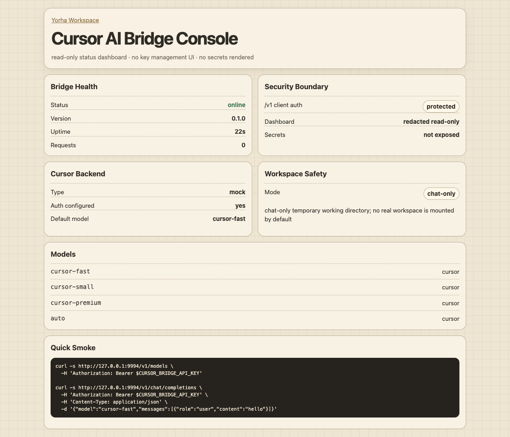

<p align="right">
  🌐 <a href="README.md">English</a> · 한국어
</p>

# Cursor AI Bridge

<p align="center">
  
</p>

<p align="center">
  <strong>로컬 Cursor AI 자동화를 OpenAI-compatible API로 연결하는 안전한 브리지와 read-only 운영 대시보드.</strong>
</p>

<p align="center">
  
  
  
  
  
</p>

Cursor AI Bridge는 Cursor의 로컬 CLI/agent backend 앞에 작은 OpenAI-compatible HTTP API를 세우는 신뢰 환경용 브리지입니다. Fastify 기반 보안 경계, client API-key 인증, read-only 운영 대시보드 뒤에서 로컬 자동화를 안전하게 다룹니다.

> [!IMPORTANT]
> Cursor AI Bridge는 Cursor credential, token, hardware-ID reset 기능을 번들하지 않습니다. 본인의 Cursor CLI/account 환경에서만 사용하고, localhost 또는 신뢰하는 VPN/tailnet 안에서만 노출하십시오.

## 한눈에 보기

| 영역      | 요약                                                                                                               |
| --------- | ------------------------------------------------------------------------------------------------------------------ |
| API 표면  | `/health`, `/dashboard`, `/v1/models`, `/v1/chat/completions`                                                      |
| 핵심 가치 | OpenAI-compatible client가 Cursor process invocation을 직접 관리하지 않고 Cursor-backed local bridge를 호출합니다. |
| 대시보드  | backend, model, workspace, auth, endpoint 상태를 보여주는 모바일 친화 read-only 상태 페이지.                       |
| 안전 경계 | client API key가 없으면 `/v1/*`는 fail-closed; 실제 workspace 접근은 명시적 opt-in.                                |
| 현재 범위 | MVP: deterministic mock backend와 Cursor CLI backend adapter, non-streaming 및 SSE streaming chat completion.      |

로컬 preview one-shot:

```bash
npm install
CURSOR_BRIDGE_API_KEY=sk-curbr-local-dev \
CURSOR_BRIDGE_BACKEND=mock \
npm run build && npm start
```

열기:

```text
http://127.0.0.1:9994/dashboard
```

정상 preview에서는 read-only 대시보드가 보이고, mock backend가 OpenAI-compatible model/chat 응답을 반환합니다.

## 이 브리지가 하는 일

- OpenAI-compatible endpoint 제공:
  - `GET /health`
  - `GET /dashboard`
  - `GET /v1/models`
  - `POST /v1/chat/completions`
- `/v1/*`에 client API-key 인증 적용:
  - `Authorization: Bearer <CURSOR_BRIDGE_API_KEY>`
  - `x-api-key: <CURSOR_BRIDGE_API_KEY>`
- `CURSOR_BRIDGE_API_KEY`가 없으면 `/v1/*`는 `503 configuration_error`를 반환합니다.
- Cursor login 상태 없이 dashboard/API smoke test를 할 수 있는 deterministic `mock` backend 포함.
- 로컬 Cursor CLI/agent 실행용 `cursor-cli` backend adapter 포함.
- 기본값은 실제 프로젝트 파일을 mount하지 않는 `chat-only` 임시 workspace 모드.
- `real-workspace`는 명시적으로 켜고, 실제 경로가 유효할 때만 사용.
- Fastify, Helmet/CSP, body limit, rate limit, Zod request validation 적용.
- `[{"type":"text","text":"..."}]` 같은 OpenAI content-part array를 Cursor CLI 호출 전에 plain text로 normalize.
- credential 입력 form, token 표시, credential 저장 UI, `reset-hwid` 동작 제외.

## 구조

```text
OpenAI-compatible client
  -> Cursor AI Bridge :9994
  -> Cursor CLI / agent backend
  -> normalized OpenAI chat.completion response
```

```mermaid
flowchart LR
  C[OpenAI-compatible client] -->|Bearer / x-api-key| B[Cursor AI Bridge]
  D[Read-only dashboard] -->|status only| B
  B --> H[/health]
  B --> M[/v1/models]
  B --> X[/v1/chat/completions]
  X --> W{Workspace mode}
  W -->|default| T[Temporary chat-only directory]
  W -->|explicit opt-in| R[Real workspace path]
  X --> A[Cursor CLI backend]
```

브리지는 HTTP/auth/dashboard 경계와 Cursor upstream 인증을 분리합니다. Cursor login/session material은 이 대시보드가 아니라 로컬 Cursor CLI 환경이 소유해야 합니다.

## 요구 사항

- Node.js **20+**
- npm **10+**
- source 실행용 macOS, Linux, WSL
- 실제 `cursor-cli` backend 사용을 위한 Cursor CLI/account 환경
- `/v1/*` 트래픽용 client-facing `CURSOR_BRIDGE_API_KEY`

UI/API 개발과 smoke test는 `mock` backend만으로 가능하며 Cursor login이 필요 없습니다.

## 설치

```bash
git clone <your-cursor-ai-bridge-repository-url> cursor-ai-bridge
cd cursor-ai-bridge
npm install
cp .env.example .env
```

최소 local `.env`:

```env
CURSOR_BRIDGE_HOST=127.0.0.1
CURSOR_BRIDGE_PORT=9994
CURSOR_BRIDGE_API_KEY=replace-with-a-long-random-client-key
CURSOR_BRIDGE_BACKEND=mock
CURSOR_BRIDGE_WORKSPACE_MODE=chat-only
```

빌드 및 실행:

```bash
npm run build
npm start
```

실제 Cursor backend로 바꾸려면 아래처럼 설정합니다. 일부 설치에서는 CLI binary가 `cursor`이고, Oracle/systemd 호스트에서는 `agent`일 수 있으므로 해당 환경에서 동작하는 executable 경로를 `CURSOR_BRIDGE_CURSOR_BIN`에 지정하십시오.

```env
CURSOR_BRIDGE_BACKEND=cursor-cli
CURSOR_BRIDGE_CURSOR_BIN=/home/ubuntu/.local/bin/agent
CURSOR_BRIDGE_DEFAULT_MODEL=composer-2.5
CURSOR_BRIDGE_CURSOR_TIMEOUT_MS=120000
```

`cursor-cli` backend는 headless chat completion에 `--print --trust`를 전달하고, 의도적으로 `--mode`를 생략합니다. 일반 `cursor` binary에서는 `cursor agent --print ...`로 실행하고, binary 이름이 standalone `agent`인 경우에는 중복 subcommand 없이 `agent --print ...`로 실행합니다. `--trust`는 headless/systemd 환경에서 workspace trust prompt로 막히는 문제를 피하고, `--mode`를 생략하면 Cursor Agent가 read-only `ask`/`plan` 모드가 아니라 쓰기 가능한 기본 headless 모드로 동작합니다.

## 첫 검증

Health check:

```bash
curl -fsS http://127.0.0.1:9994/health
```

인증된 model list:

```bash
export CURSOR_BRIDGE_API_KEY="$YOUR_CURSOR_BRIDGE_API_KEY"

curl -fsS http://127.0.0.1:9994/v1/models \
  -H "Authorization: Bearer [BRIDGE_CLIENT_TOKEN]"
```

Non-streaming chat completion:

```bash
curl -sS http://127.0.0.1:9994/v1/chat/completions \
  -H "Authorization: Bearer [BRIDGE_CLIENT_TOKEN]" \
  -H 'Content-Type: application/json' \
  -d '{
    "model": "cursor-fast",
    "messages": [{"role": "user", "content": "Reply exactly: OK"}],
    "temperature": 0
  }'
```

SSE streaming chat completion:

```bash
curl -N -sS http://127.0.0.1:9994/v1/chat/completions \
  -H "Authorization: Bearer $CURSOR_BRIDGE_API_KEY" \
  -H 'Content-Type: application/json' \
  -d '{
    "model": "cursor-fast",
    "stream": true,
    "messages": [{"role": "user", "content": "Reply in chunks"}]
  }'
```

OpenAI content-part array 요청도 받을 수 있으며, text-only Cursor CLI backend로 넘기기 전에 plain text로 normalize합니다.

```bash
curl -sS http://127.0.0.1:9994/v1/chat/completions \
  -H "Authorization: Bearer $CURSOR_BRIDGE_API_KEY" \
  -H 'Content-Type: application/json' \
  -d '{
    "model": "composer-2.5",
    "messages": [
      {
        "role": "user",
        "content": [{"type": "text", "text": "Reply exactly: OK"}]
      }
    ]
  }'
```

이미지 block은 현재 bridge가 multimodal Cursor automation이 아니라 text chat completion semantics를 대상으로 하므로 `[image omitted: cursor composer bridge is text-only]`로 표시합니다. 지원하지 않는 typed block은 `[unsupported content type omitted: <type>]`로 표시하며, message 하나당 content part는 최대 1,000개까지 허용합니다.

LiteLLM model entry 예시:

```yaml
model_name: composer-2.5
litellm_params:
  model: openai/composer-2.5
  api_base: http://127.0.0.1:9994/v1
  api_key: os.environ/CURSOR_BRIDGE_API_KEY
```

## 웹 대시보드

열기:

```text
http://127.0.0.1:9994/dashboard
```

대시보드는 의도적으로 read-only입니다. 표시 항목:

- bridge version, uptime, request counter;
- backend mode와 backend health;
- API key를 출력하지 않는 auth configured/not-configured 상태;
- workspace safety mode;
- 사용 가능한 model ID;
- redacted key placeholder가 들어간 curl 예시.

대시보드에는 key 입력/저장 UI가 없습니다. 나중에 admin write 기능을 추가하더라도 별도의 admin policy를 두고 `/v1/*` client auth는 계속 fail-closed로 유지해야 합니다.

## 설정

| 변수                              | 기본값        | 설명                                                                                                         |
| --------------------------------- | ------------- | ------------------------------------------------------------------------------------------------------------ |
| `CURSOR_BRIDGE_HOST`              | `127.0.0.1`   | HTTP bind address. 신뢰 네트워크 뒤가 아니면 local-only 유지.                                                |
| `CURSOR_BRIDGE_PORT`              | `9994`        | HTTP port.                                                                                                   |
| `CURSOR_BRIDGE_API_KEY`           | unset         | `/v1/*`에 필수. 없으면 `503 configuration_error`.                                                            |
| `CURSOR_BRIDGE_BACKEND`           | `mock`        | `mock` 또는 `cursor-cli`.                                                                                    |
| `CURSOR_BRIDGE_DEFAULT_MODEL`     | `cursor-fast` | 기본 model이며, custom 값이면 `/v1/models` discovery에도 노출됨. 예: `composer-2.5`.                         |
| `CURSOR_BRIDGE_WORKSPACE_MODE`    | `chat-only`   | `chat-only` 또는 `real-workspace`.                                                                           |
| `CURSOR_BRIDGE_REAL_WORKSPACE`    | unset         | `real-workspace`에서만 필요. 경로가 존재해야 함.                                                             |
| `CURSOR_BRIDGE_CURSOR_BIN`        | `cursor`      | Cursor CLI executable 이름/경로. CLI가 `agent`로 설치된 환경에서는 `/home/ubuntu/.local/bin/agent`처럼 지정. |
| `CURSOR_BRIDGE_CURSOR_TIMEOUT_MS` | `120000`      | 1초–10분 범위로 clamp.                                                                                       |

## Workspace 안전 모델

기본 모드:

```env
CURSOR_BRIDGE_WORKSPACE_MODE=chat-only
```

이 모드에서는 요청마다 임시 chat-only directory를 사용합니다. 자동화 요청에 실제 프로젝트 checkout을 노출하지 않기 때문에 bridge 실험 기본값으로 안전합니다.

실제 workspace 모드는 명시적으로 켜야 합니다.

```env
CURSOR_BRIDGE_WORKSPACE_MODE=real-workspace
CURSOR_BRIDGE_REAL_WORKSPACE=/absolute/path/to/project
```

설정된 경로는 존재해야 합니다. 호출 client와 network boundary를 신뢰할 수 없는 경우 민감한 workspace를 bind하지 마십시오.

## Client 인증

`CURSOR_BRIDGE_API_KEY`는 client-facing bridge key이며 Cursor upstream credential이 아닙니다.

```env
CURSOR_BRIDGE_API_KEY=replace-with-a-long-random-client-key
```

지원 header:

```http
Authorization: Bearer <key>
x-api-key: <key>
```

보안 동작:

- `/health`, `/dashboard`는 인증 없는 read-only 상태 endpoint입니다.
- `/v1/models`, `/v1/chat/completions`는 client key가 필요합니다.
- client key가 unset이면 `/v1/*`는 bridge를 열어두지 않고 `503`을 반환합니다.
- dashboard는 raw key나 Cursor auth material을 출력하지 않습니다.

## 개발

```bash
npm run verify
```

Quality gate:

- TypeScript typecheck
- ESLint
- Prettier format check
- Vitest tests
- production build

유용한 명령:

```bash
npm run dev
npm test
npm run typecheck
npm run lint
npm run build
npm audit --omit=dev
```

## 보안 메모

- public internet service가 아니라 trusted-environment bridge로 취급하십시오.
- 기본값은 `CURSOR_BRIDGE_HOST=127.0.0.1`로 유지하십시오.
- `0.0.0.0`에 bind한다면 신뢰하는 VPN/tailnet/private proxy 뒤에 두고 강한 `CURSOR_BRIDGE_API_KEY`를 유지하십시오.
- `.env`, Cursor auth file, token, API key를 log/commit하지 마십시오.
- caller를 신뢰할 수 없으면 real workspace mode를 켜지 마십시오.

## License

MIT. 현재 package license 선언은 `package.json`을 참고하십시오.
